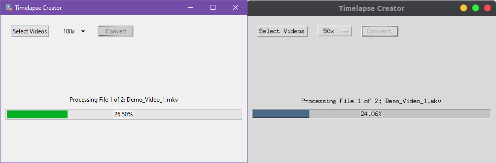

[![Release Version][release-shield]][release-url]
[![Downloads][downloads-shield]][downloads-url]
[![Contributors][contributors-shield]][contributors-url]
[![Forks][forks-shield]][forks-url]
[![Stargazers][stars-shield]][stars-url]
[![Issues][issues-shield]][issues-url]
[![MIT License][license-shield]][license-url]
[![LinkedIn][linkedin-shield]][linkedin-url]

<!-- PROJECT LOGO -->
<br />
<p align="center">
    

  <h2 align="center">Timelapse Creator</h2>

  <p align="center">
    A blazing-fast, cross-platform desktop application for creating beautiful timelapses from videos.
    <br />
    Built with Rust + Tauri + React for optimal performance and a native-like experience.
    <br />
    <a href="https://github.com/animikhaich/Timelapse-Creator#demo">View Demo</a>
    ·
    <a href="https://github.com/animikhaich/Timelapse-Creator/releases/latest">Download</a>
    ·
    <a href="https://github.com/animikhaich/Timelapse-Creator/issues/new">Report Bug</a>
    ·
    <a href="https://github.com/animikhaich/Timelapse-Creator/issues/new">Request Feature</a>
  </p>
</p>

<div align="center">
  
</div>

<!-- TABLE OF CONTENTS -->

## Table of Contents

- [Table of Contents](#table-of-contents)
- [About The Project](#about-the-project)
- [Features](#features)
- [Demo](#demo)
- [Downloads](#downloads)
- [Getting Started](#getting-started)
  - [Prerequisites](#prerequisites)
  - [Installation](#installation)
  - [Development Setup](#development-setup)
- [Usage](#usage)
- [Building](#building)
- [Tech Stack](#tech-stack)
- [Changelog](#changelog)
- [Roadmap](#roadmap)
- [Contributing](#contributing)
- [License](#license)
- [Contact](#contact)

<!-- ABOUT THE PROJECT -->

## About The Project

Time-lapse photography is a technique whereby the frequency at which film frames are captured is much more spread out than the frequency used to view the sequence. It allows users to create beautiful videos of slow-changing environments.

**Timelapse Creator** is a complete rewrite of the original Python/Tkinter application, now built with modern technologies for:

- ⚡ **Blazing Fast Performance** - Rust backend with FFmpeg for highly optimized video processing
- 🎨 **Beautiful Native UI** - Modern, responsive interface that looks great on all platforms
- 📦 **Small Bundle Size** - Tauri provides native-like apps with minimal footprint
- 🖥️ **True Cross-Platform** - Works seamlessly on Windows, macOS, and Linux

## Features

- 🎬 **Batch Processing** - Convert multiple videos at once
- 🚀 **Speed Options** - Choose from 2x to 1000x speed multipliers
- 📊 **Real-time Progress** - Visual progress tracking for each conversion
- 🎯 **Format Support** - MP4, WebM, AVI, MOV, MKV, and more
- 💾 **Auto-save** - Converted files saved to organized output directory
- 🔒 **Secure** - No internet required, all processing done locally

## Demo

_Demo video coming soon._

## Downloads

Pre-built executables are available for all major platforms:

| Platform | Download | Requirements |
|----------|----------|--------------|
| Windows | [Download from latest release](https://github.com/animikhaich/Timelapse-Creator/releases/latest) | Windows 10+ |
| macOS | [Download from latest release](https://github.com/animikhaich/Timelapse-Creator/releases/latest) | macOS 10.15+ |
| Linux | [Download from latest release](https://github.com/animikhaich/Timelapse-Creator/releases/latest) | Modern Linux distros |

**Note**: FFmpeg must be installed on your system for video processing.

### Installing FFmpeg

**Windows:**
```bash
# Using Chocolatey
choco install ffmpeg

# Or download from https://ffmpeg.org/download.html
```

**macOS:**
```bash
# Using Homebrew
brew install ffmpeg
```

**Linux:**
```bash
# Ubuntu/Debian
sudo apt install ffmpeg

# Fedora
sudo dnf install ffmpeg

# Arch
sudo pacman -S ffmpeg
```

## Getting Started

### Prerequisites

For running the application:
- FFmpeg installed and available in PATH

For development:
- [Node.js](https://nodejs.org/) (v18 or later)
- [Rust](https://www.rust-lang.org/tools/install) (latest stable)
- [FFmpeg](https://ffmpeg.org/download.html)

### Installation

1. Download the appropriate executable for your platform from the [Releases page](https://github.com/animikhaich/Timelapse-Creator/releases/latest)

2. Run the executable
   - **Windows**: Double-click the `.exe` file
   - **macOS**: Open the `.dmg` and drag to Applications
   - **Linux**: Make the `.AppImage` executable and run it

### Development Setup

1. Clone the repository
```bash
git clone https://github.com/animikhaich/Timelapse-Creator.git
cd Timelapse-Creator
```

2. Install frontend dependencies
```bash
cd frontend
npm install
cd ..
```

3. Run in development mode

#### Desktop App Mode (Recommended for full development)
```bash
cd src-tauri
cargo tauri dev
```
This builds both the Rust backend and React frontend, then launches the desktop application with hot-reloading enabled.

#### Web App Mode (For UI development only)
```bash
cd frontend
npm run dev
```
This runs the React frontend in the browser, useful for rapid UI iteration without the desktop wrapper.

## Usage

1. **Select Videos** - Click "Select Videos" to choose one or more video files
2. **Choose Speed** - Select the desired speed multiplier from the dropdown (2x - 1000x)
3. **Convert** - Click "Convert" to start processing
4. **Find Output** - Converted files are saved in an `outputs` folder next to the source files

## Building

### Development Build
```bash
cd src-tauri
cargo tauri dev
```

### Production Build
```bash
cd src-tauri
cargo tauri build
```

The built executables will be in `src-tauri/target/release/bundle/`.

### Build Platforms

| Build Environment | Output Formats |
|-------------------|---------------|
| Windows | `.exe`, `.msi` |
| macOS | `.app`, `.dmg` |
| Linux | `.AppImage`, `.deb`, `.rpm` |

## Tech Stack

| Component | Technology |
|-----------|------------|
| Backend | [Rust](https://www.rust-lang.org/) |
| Framework | [Tauri 2.0](https://tauri.app/) |
| Frontend | [React](https://react.dev/) + [TypeScript](https://www.typescriptlang.org/) |
| Build Tool | [Vite](https://vitejs.dev/) |
| Video Processing | [FFmpeg](https://ffmpeg.org/) |

### Why This Stack?

- **Rust + Tauri**: Native performance with ~90% smaller bundle size than Electron
- **React**: Modern, component-based UI development
- **TypeScript**: Type safety and better developer experience
- **FFmpeg**: Industry-standard video processing, highly optimized

## Changelog

See [CHANGELOG.md](CHANGELOG.md) for version history.

## Roadmap

See the [open issues](https://github.com/animikhaich/Timelapse-Creator/issues?q=is%3Aopen) for planned features and known issues.

Planned features:
- [ ] Custom output format selection
- [ ] Preview before conversion
- [ ] Drag and drop support
- [ ] Custom output directory selection
- [ ] Audio track options (keep/remove)
- [ ] Quality presets

## Contributing

Contributions are welcome! Please feel free to submit a Pull Request.

1. Fork the Project
2. Create your Feature Branch (`git checkout -b feature/AmazingFeature`)
3. Commit your Changes (`git commit -m 'Add some AmazingFeature'`)
4. Push to the Branch (`git push origin feature/AmazingFeature`)
5. Open a Pull Request

## License

Distributed under the MIT License. See [LICENSE.md](LICENSE.md) for more information.

## Contact

**Animikh Aich**

- LinkedIn: [Animikh Aich](https://www.linkedin.com/in/animikh-aich/)
- Email: [animikhaich@gmail.com](mailto:animikhaich@gmail.com)
- X: [@animikh_aich](https://x.com/animikh_aich)

<!-- MARKDOWN LINKS & IMAGES -->

[release-shield]: https://img.shields.io/github/release/animikhaich/Timelapse-Creator.svg?style=flat-square
[release-url]: https://github.com/animikhaich/Timelapse-Creator/releases
[downloads-shield]: https://img.shields.io/github/downloads/animikhaich/Timelapse-Creator/total.svg?style=flat-square
[downloads-url]: https://github.com/animikhaich/Timelapse-Creator/releases
[contributors-shield]: https://img.shields.io/github/contributors/animikhaich/Timelapse-Creator.svg?style=flat-square
[contributors-url]: https://github.com/animikhaich/Timelapse-Creator/graphs/contributors
[forks-shield]: https://img.shields.io/github/forks/animikhaich/Timelapse-Creator.svg?style=flat-square
[forks-url]: https://github.com/animikhaich/Timelapse-Creator/network/members
[stars-shield]: https://img.shields.io/github/stars/animikhaich/Timelapse-Creator.svg?style=flat-square
[stars-url]: https://github.com/animikhaich/Timelapse-Creator/stargazers
[issues-shield]: https://img.shields.io/github/issues/animikhaich/Timelapse-Creator.svg?style=flat-square
[issues-url]: https://github.com/animikhaich/Timelapse-Creator/issues
[license-shield]: https://img.shields.io/github/license/animikhaich/Timelapse-Creator.svg?style=flat-square
[license-url]: https://github.com/animikhaich/Timelapse-Creator/blob/master/LICENSE.md
[linkedin-shield]: https://img.shields.io/badge/-LinkedIn-black.svg?style=flat-square&logo=linkedin&colorB=555
[linkedin-url]: https://www.linkedin.com/in/animikh-aich/
[product-screenshot]: assets/screenshot.png
